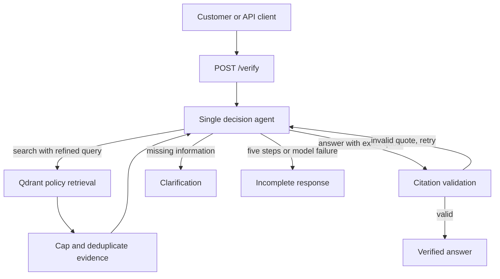

# Week 16 — Agentify the shop assistant

This extends the Week 15 customer-support assistant in `source/`. Its existing `/chat`, routing, retrieval, tool, ingestion, streaming, cache, and UI paths remain available. The new `/verify` endpoint checks a policy question against the indexed corpus.

## Documentation

| Guide | Contents |
| --- | --- |
| [Getting started](docs/GETTING_STARTED.md) | Demo and live setup, commands, environment settings |
| [Architecture](docs/ARCHITECTURE.md) | Services, original chat flow, new agent loop, safeguards and limits |
| [File and API reference](docs/FILE_AND_API_REFERENCE.md) | Source inventory, endpoints, evaluation cases, known limits |
| [Evaluation results](evaluation-results.md) | Generated metrics, failure log, and trajectories |
| [Executed notebook](agent_demo.ipynb) | Step-by-step loop demonstration |

## Screen recording

[Watch the Week 16 screen recording](screen-recording-week16.mp4).

**Why a fixed pipeline is insufficient:** A search may return no evidence, incomplete evidence, or conflicting policy snippets, so the next query, answer, or clarification must depend on what the previous search found.

## Run

Use the Week 15 Docker and Ollama setup, then from `source/` run `docker compose up -d --build`. Send `POST http://localhost:8080/verify` with `{"message":"Can I cancel an order after it ships?"}`. The response contains `status` (`completed`, `needs_clarification`, or `incomplete`), `answer`, verified `citations`, `trajectory`, `steps`, and `tokens`. The original UI and `/chat` continue to work.

## Architecture diagram

## Context Engineering Technique

Each search may return long passages. At the search boundary, `agent._compact` keeps the three highest scoring unique snippets and caps each at 650 characters. The next prompt is rebuilt from those snippets and short search notes, so raw tool transcripts do not accumulate across iterations. This keeps the decision context focused and limits cost. Quotes are validated against the exact snippet shown to the model.

## Agentic Pattern

This is a **single-agent loop**. Search is a bounded tool call, and the same decision agent chooses whether to refine the query, ask the customer, or answer. A second agent would add coordination and token cost without useful context isolation or parallel work for this small policy corpus. The loop ends on an answer, clarification, model failure, or five decisions.

## Evaluation Harness

`python source/scripts/evaluate_agent.py` runs the real loop with scripted model decisions and retrieval fixtures, then writes [evaluation-results.md](evaluation-results.md). It measures task completion, selected tool and argument validity, trajectory length, per-query tokens, and a failure log using hard, soft, and cascading soft failure labels. The fixture's 42 tokens per model decision are **simulated**; live `/verify` reports provider `total_tokens` when available. The deterministic harness tests decisions and guards, not live model quality.

Open [agent_demo.ipynb](agent_demo.ipynb) for an executed, step-by-step demonstration of the same loop, including refined search, invalid-citation rejection, timeout handling, and the step limit.

For a local interactive demonstration without Docker or Ollama, run `python -m streamlit run source/ui/agent_demo.py` from this folder and open the displayed URL. This UI runs the real loop with scripted fixtures and labels its token figures as simulated. The full live app uses the Docker stack above.

## Additional Requirements

**Skill vs. agent:** Policy verification instructions could be packaged as a Skill, but a Skill alone cannot inspect changing retrieval results, select a new tool call, and enforce a bounded search and citation loop. The capability therefore lives in the agent; its fixed instructions are in `agent.py`.

**Token and cost accounting:** The agent accumulates each model call's reported `total_tokens` in the response. If the provider omits usage, that call contributes zero, so this number is a lower bound. No multi-agent baseline applies. The evaluation report exposes simulated per-query usage so longer trajectories have visible cost.

**Failure injection:** The harness raises a search timeout in `injected_tool_failure`. The agent records `search_error`, gives the model a short error note, and the scripted model asks for clarification. It does not claim an unverified refund deadline. Invalid citations are also rejected and returned to the loop.

**Tool vs. agent boundary:** Qdrant is an external retrieval service but is modeled as a bounded search tool, with a query and a three-result limit. It does not make independent decisions or negotiate tasks, so agent-to-agent coordination would add no useful capability here.
