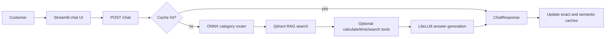
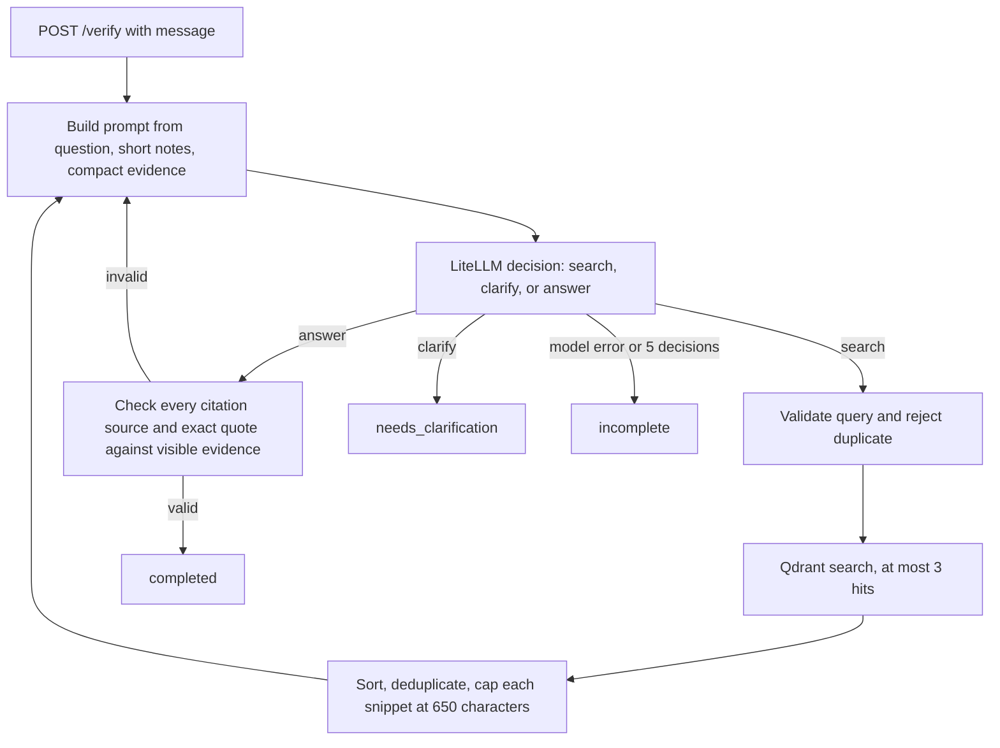

# Architecture and request flow

## Services and libraries

| Component | Implementation | Role |
| --- | --- | --- |
| API | FastAPI, Pydantic, Uvicorn | HTTP endpoints and request validation |
| Language model client | LiteLLM | Sends requests to Ollama's OpenAI-compatible endpoint; supports configured fallbacks, concurrency limit, and circuit breaker |
| Policy search | Qdrant and FastEmbed | Embeds policy chunks and retrieves similar text |
| Router | DistilBERT ONNX model, ONNX Runtime, Tokenizers, NumPy | Routes the original `/chat` request to one of 11 support categories |
| Cache and rate limit | Redis | Exact chat cache and per-client request count; semantic chat cache uses Qdrant |
| UI | Streamlit and HTTPX | Original chat UI and separate local scripted agent demo |
| Deployment | Docker Compose | Starts API, UI, Qdrant, and Redis; optional trainer and GPU vLLM profiles |
| Training | PyTorch, Transformers, Datasets, scikit-learn, ONNX | Builds the Week 15 router artifact; not used by `/verify` at request time |

## Original Week 15 `/chat` path

`/chat` uses a predefined sequence. The classifier chooses a support category; retrieval provides policy extracts; LiteLLM returns an `Answer` JSON object with confidence and citations. The API can run up to three rounds of optional tool calls before answer generation. That path also offers `/chat/stream` and `/chat/batch`. It is separate from the Week 16 verification loop.

## Week 16 `/verify` path

The model chooses its next action based on the latest evidence and search notes. `agent.verify` executes at most five decisions. Valid search queries must be nonempty, at most 300 characters, and different from earlier queries. A valid answer requires at least one citation whose filename and quote match a snippet currently visible to the model. If the model repeats an invalid action, the step limit still stops the run. A model failure returns an incomplete result; a search exception is recorded in the trajectory and exposed to the next decision as a short error note.

`rag.search` currently catches its own Qdrant exceptions and returns an empty list. Therefore a real Qdrant failure may look like zero matches to `/verify`; the injected timeout fixture raises directly so the agent's explicit `search_error` branch is tested. An exact quote check verifies source presence, but it does not prove that the final answer is logically entailed by that quote.

## Context engineering

The verification loop rebuilds each model prompt from compact structured state, rather than accumulating every previous response and raw tool output. It retains the customer question, brief search notes, up to three unique high-score passages, and the number of remaining decisions. Each passage is limited to 650 characters. This bounds retrieval context and avoids letting repeated searches swell the prompt. Older evidence can be displaced by higher scoring new evidence; citation validation uses only the evidence still visible at the final decision.

## Tool and agent boundary

The Week 16 pattern is a single decision agent. Qdrant search is a bounded tool call, not another agent: it accepts a query and result limit and returns passages without choosing subsequent actions. The Week 15 category labels are routing outputs, not independently executing agents. The scripted demo replaces only the decision provider and search function while calling the same `agent.verify` implementation.

## Responses and safeguards

The `/verify` result contains `status`, `answer`, `citations`, `trajectory`, `tokens`, `steps`, and `model`. `completed` means an answer passed the exact citation check. `needs_clarification` means the model requested a customer detail. `incomplete` means the loop stopped without a grounded answer. Provider token usage is summed across decisions when available; missing usage contributes zero. The response does not estimate money cost.

The app's policy documents are data. The Week 15 prompt explicitly tells the model to ignore instructions inside extracts and tool output. The Week 16 prompt tells the model to use only visible evidence. The Week 16 citation validator provides an additional mechanical check, with the semantic limitation noted above.
