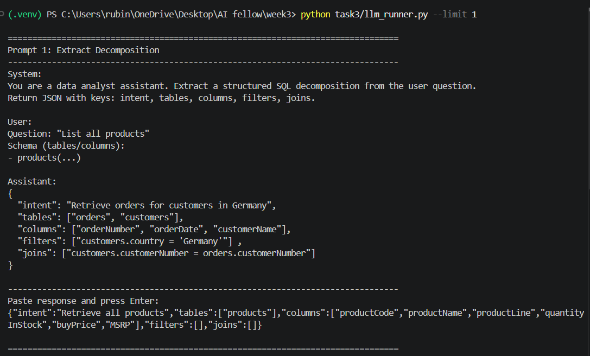

# Task 3: Text-to-SQL Pipeline

This task extends Task 2 into a full Text-to-SQL system. It takes structured decompositions, generates SQL, validates safety, executes queries, retries once on error, logs every run, and writes evaluation reports.

## Inputs
- task2/decompositions.json: Structured breakdowns (intent, tables, columns, joins)
- task2/queries.sql: Reference SQL (used only for comparison)

## Outputs
- task3/generated_queries.sql: SQL generated from decompositions
- task3/comparison.md: SQL text comparison vs Task 2 reference
- task3/evaluation.md: Execution summary + sample rows
- task3/logs/execution.log: Per-query JSONL execution log

## Project Structure (What Each File Does)
- task3/main.py: Orchestrates the pipeline end-to-end and writes reports
- task3/sql_generator.py: Rule-based SQL generation from decompositions
- task3/validator.py: Enforces SELECT-only safety rules
- task3/database.py: Executes SQL using docker + psql
- task3/executor.py: Executes with retry and writes logs
- task3/generated_queries.sql: Generated SQL output
- task3/comparison.md: SQL text comparison report
- task3/evaluation.md: Execution and evaluation report
- task3/logs/execution.log: Execution log (JSONL)

## How It Works (Step-by-Step)
1. Read decompositions from task2/decompositions.json
2. Generate SQL using rule-based heuristics:
	- Aggregation detection: COUNT, SUM, AVG, MIN, MAX
	- DISTINCT when intent says unique or distinct
	- Join conditions from Task 2
3. Validate safety:
	- Only SELECT statements allowed
	- Blocks dangerous keywords like DELETE/UPDATE/INSERT
4. Execute SQL in PostgreSQL:
	- Uses docker container mydb with psql
	- Captures stdout/stderr and return codes
5. Retry once if execution fails:
	- Error parsing tries common column/table fixes
6. Log + evaluate:
	- Writes a JSONL log entry per query
	- Writes evaluation report with summary and samples

## How to Run Task 3
From the repo root:
```
python task3/main.py
```

Optional legacy entry point (runs the same pipeline):
```
python task3/generate_sql.py
```

## Optional LLM Mode (Manual Prompt-Chaining)
This runner uses the prompt templates and pauses for you to paste LLM outputs.

Run on one question:
```
python task3/llm_runner.py --limit 1
```


How it works:
1. Prompt 1: Extract decomposition JSON
2. Prompt 2: Generate SQL
3. Execute SQL
4. If it fails, Prompt 3: Fix SQL (retry once)

## What to Check After Running
- Generated SQL: task3/generated_queries.sql
- Execution log: task3/logs/execution.log
- Evaluation report: task3/evaluation.md
- SQL comparison: task3/comparison.md

## Notes
- Only SELECT queries are allowed.
- Retry limit is 1 per query.
- The database is expected to be available in docker container mydb.

## Prompt-Chaining Templates (Optional)
If you want to switch from rule-based logic to LLM prompting, use the templates in task3/prompts:
- task3/prompts/01_extract_decomposition.txt: Extract structured decomposition from a question
- task3/prompts/02_generate_sql.txt: Convert decomposition into SQL
- task3/prompts/03_fix_sql.txt: Fix SQL based on error message

Example flow:
1. Question -> prompt 01 -> JSON decomposition
2. Decomposition -> prompt 02 -> SQL query
3. Execute SQL; on error -> prompt 03 -> corrected SQL (retry once)
