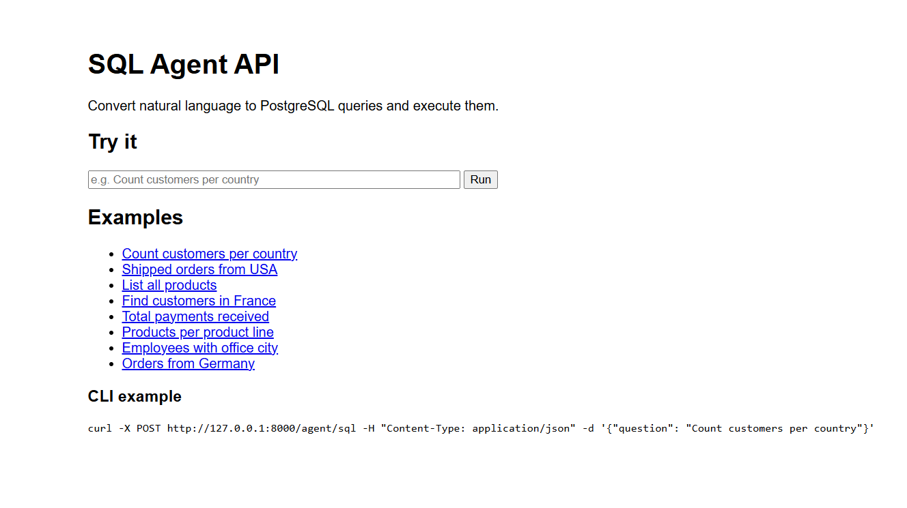
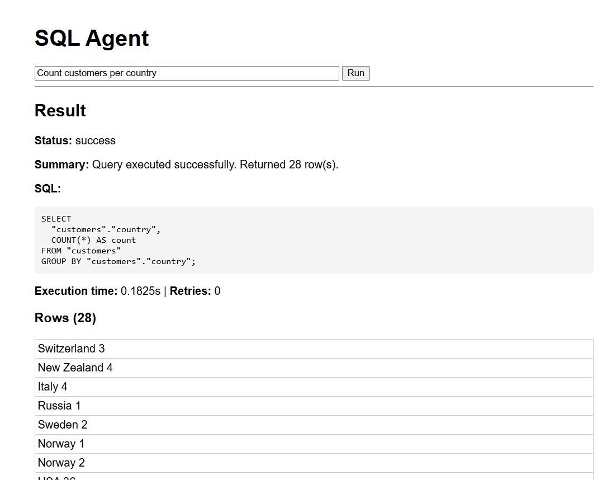

# Task 4 — AI SQL Agent

An intelligent natural-language-to-SQL agent that converts plain English questions into safe PostgreSQL `SELECT` queries, executes them against a Docker-based `classicmodels` database, self-corrects on errors (up to 3 retries), and returns structured JSON responses.




---

## Architecture

```
┌─────────────┐     ┌─────────────────────────────────────────────┐     ┌──────────────┐
│  FastAPI     │────▶│              SQL Agent                     │────▶│  PostgreSQL   │
│  POST /agent │     │                                             │     │  (Docker)     │
│  /sql        │     │  Step 1  Understand the question           │     └──────────────┘
└─────────────┘     │  Step 2  Generate SQL (LLM / fallback)     │
                    │  Step 3  Validate safety (SELECT-only)     │
                    │  Step 4  Execute query                      │
                    │  Step 5  Error handling & self-correction  │
                    │  Step 6  Return structured JSON             │
                    └─────────────────────────────────────────────┘
```

---

## File Overview

| File | Purpose |
|------|---------|
| `app/main.py` | FastAPI server with `POST /agent/sql` and `POST /agent/sql/raw` endpoints |
| `app/agent.py` | Core 6-step workflow: decompose → generate → validate → execute → retry → respond |
| `app/llm_client.py` | SQL generation via OpenAI API (if `OPENAI_API_KEY` set) or template-based fallback |
| `app/database.py` | Docker PostgreSQL execution layer (reuses `docker exec` pattern from task3) |
| `app/validator.py` | SQL safety validator — blocks all non-SELECT statements and dangerous keywords |
| `app/models.py` | Pydantic request/response models (`AgentRequest`, `AgentResponse`) |
| `app/logger.py` | Structured JSON logging to `logs/agent.log` |
| `run.py` | Entry point to start the FastAPI server |
| `test_agent.py` | 8 test questions covering all query types |

---

## 6-Step Agent Workflow

### Step 1 — Understand the Question
The agent classifies the intent by keyword matching (`COUNT`, `SUM`, `AVG`, `MAX`, `MIN`, `LIST`) and identifies relevant tables via a keyword-to-table mapping.

### Step 2 — Generate SQL
Two SQL generation engines, used in priority order:

**A) OpenAI LLM (auto-detected)**
If the `OPENAI_API_KEY` environment variable is set, the agent sends the question to `gpt-4o-mini` with the full database schema and strict SQL-generation rules. The response is parsed and cleaned.

**B) Template-based fallback (always available)**
A rule-based engine that:
- Detects tables using keyword scoring (`TABLE_KEYWORDS` mapping)
- Detects aggregation type (`AGG_KEYWORDS`)
- Detects relevant columns via camelCase-aware matching (`_split_camel`)
- Infers JOINs from a predefined `JOIN_MAP` of table pairs
- Detects filters from known countries, order statuses, and years
- Generates `GROUP BY` for aggregation queries with non-star columns
- Applies `LIMIT 50` on unfiltered list queries

### Step 3 — Validate SQL Safety
The validator enforces:
- SQL must start with `SELECT`
- No `INSERT`, `UPDATE`, `DELETE`, `DROP`, `ALTER`, `CREATE`, `TRUNCATE`, `REPLACE`, `EXECUTE`, `CALL`, `MERGE`
- No multiple semicolon-delimited statements
- No dangerous keywords (`pg_sleep`, `xp_cmdshell`, etc.)
- Single `SELECT` statement only (excludes multi-statement UNION)

### Step 4 — Execute Query
Runs the SQL via `docker exec` against the PostgreSQL `mydb` container using `psql` with `ON_ERROR_STOP=1` and tab-separated output.

### Step 5 — Error Handling & Self-Correction
If execution fails, the agent:
1. Parses the PostgreSQL error (missing column, missing table, ambiguous column, syntax error)
2. Attempts to fix the SQL using local rules (wrong table prefix, syntax cleanup)
3. Falls back to OpenAI LLM for smart error correction (if API key is set)
4. Regenerates the SQL from scratch as a last resort
5. Re-validates the fixed SQL before re-execution
6. Retries up to **3 times** before failing

### Step 6 — Final Response
Returns structured JSON:

```json
{
  "sql": "SELECT ...",
  "result": ["row1", "row2", ...],
  "summary": "Query executed successfully. Returned N row(s).",
  "status": "success",
  "execution_time": 0.1857,
  "retries": 0
}
```

On failure:
```json
{
  "sql": "SELECT ...",
  "result": null,
  "summary": "SQL execution failed after retries",
  "status": "failed",
  "error": "ERROR: column ... does not exist",
  "execution_time": 0.393,
  "retries": 2
}
```

On safety block:
```json
{
  "status": "error",
  "summary": "Unsafe query detected: Forbidden tokens present: drop"
}
```

---

## Database Schema (classicmodels)

| Table | Key Columns |
|-------|------------|
| `customers` | customerNumber, customerName, city, country, salesRepEmployeeNumber |
| `orders` | orderNumber, orderDate, status, customerNumber |
| `orderdetails` | orderNumber, productCode, quantityOrdered, priceEach |
| `products` | productCode, productName, productLine, quantityInStock, buyPrice, MSRP |
| `productlines` | productLine, textDescription |
| `employees` | employeeNumber, lastName, firstName, officeCode, reportsTo, jobTitle |
| `offices` | officeCode, city, country |
| `payments` | customerNumber, checkNumber, paymentDate, amount |

All column names use camelCase and **must be double-quoted** in PostgreSQL (e.g., `"customers"."customerNumber"`).

---

## How to Run

### Prerequisites
- Docker container `mydb` running PostgreSQL with the `classicmodels` database
- Python 3.10+

### Install dependencies
```bash
cd task4
pip install -r requirements.txt
```

### Start the API server
```bash
python run.py
# → FastAPI running on http://0.0.0.0:8000
```

### Query the agent
```bash
curl -X POST http://localhost:8000/agent/sql \
  -H "Content-Type: application/json" \
  -d '{"question": "Count customers per country"}'
```

### Run tests (CLI mode, no server needed)
```bash
python test_agent.py
```

### Use OpenAI (optional)
```bash
# Windows PowerShell
$env:OPENAI_API_KEY="sk-..."
python run.py
```

When `OPENAI_API_KEY` is set, the agent uses `gpt-4o-mini` for smarter SQL generation and error correction. Otherwise it falls back to the built-in template engine.

---

## API Endpoints

| Method | Path | Description |
|--------|------|-------------|
| `GET` | `/health` | Health check |
| `POST` | `/agent/sql` | Natural language → SQL → execution → JSON (Pydantic model) |
| `POST` | `/agent/sql/raw` | Same as above, returns raw dict (no model validation) |

### Request body
```json
{
  "question": "How many shipped orders are from USA customers?"
}
```

### Response (success)
```json
{
  "sql": "SELECT COUNT(*) AS count\nFROM \"customers\"\nJOIN \"orders\" ON \"orders\".\"customerNumber\" = \"customers\".\"customerNumber\"\nWHERE \"customers\".\"country\" = 'USA' AND \"orders\".\"status\" = 'Shipped';",
  "result": ["105"],
  "summary": "Query executed successfully. Returned 1 row(s).",
  "status": "success",
  "execution_time": 0.213,
  "retries": 0
}
```

---

## Test Results

All 8 test queries pass:

| Question | Status | Result |
|----------|--------|--------|
| How many shipped orders are from USA customers? | ✅ | 105 |
| Get employees with office city | ✅ | 23 rows |
| Count customers per country | ✅ | 28 rows |
| List all products | ✅ | 50 rows |
| Show all orders from customers in Germany | ✅ | 7 rows |
| What is the total amount of payments received? | ✅ | 8,853,839.23 |
| Find customers in France | ✅ | 12 rows |
| How many products are in each product line? | ✅ | 7 rows (grouped) |

---

## Key Design Decisions

**Double-quoted identifiers** — The database uses mixed-case column names (e.g., `customerNumber`). PostgreSQL folds unquoted identifiers to lowercase, so all generated SQL uses `"table"."column"` syntax to preserve case.

**Dual SQL generation** — The agent tries OpenAI first for maximum accuracy, then seamlessly falls back to a rule-based engine that handles the most common query patterns (COUNT, SUM, JOIN, GROUP BY, WHERE filters).

**CamelCase column matching** — The fallback generator splits column names on uppercase boundaries (e.g., `productLine` → `["product", "line"]`) and matches each component word against the natural language question. This enables accurate column detection for queries like "How many products are in each product line?".

**Safe by design** — Every SQL query passes through a validator that blocks all non-SELECT statements, dangerous keywords, and multi-statement injections before execution.

**Self-healing** — The agent parses PostgreSQL errors and applies fixes automatically: wrong table prefixes are swapped, syntax errors in trailing commas are cleaned, ambiguous columns are qualified with their correct table, and if all else fails, the SQL is regenerated from scratch.
